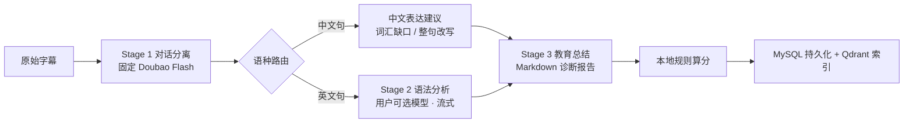

# Khan Kiddo v2

> 把你和 ChatGPT 的**英语口语对话**，变成一份可量化、可复盘的学习诊断报告。

线上站点：[khankiddo.top](https://khankiddo.top)

粘贴（或用浏览器扩展一键导入）一段 ChatGPT 语音对话字幕，Khan Kiddo 会逐句找出你的语法与表达问题、给出改写建议、算出自然度得分，并把所有错句沉淀成可检索的个人语料库 —— 之后你可以直接向 AI 助手提问「我最近最常犯的时态错误是什么」。

技术栈：**Java 21 + Spring Boot 3.5 + LangChain4j + MyBatis-Plus + MySQL 8 + Qdrant** ｜ **Vue 3 + Vite + TypeScript** ｜ **Chrome MV3 扩展**


---

## 核心亮点

### 1. 三阶段 LLM 流水线，SSE 全程流式

对话分析不是"一个 prompt 打包丢给大模型"，而是拆成职责单一、可分别换模型的阶段（`conversation/ConversationAnalysisPipeline.java`）：




| 阶段        | 职责                                  | 模型                                    | 设计要点                                      |
| --------- | ----------------------------------- | ------------------------------------- | ----------------------------------------- |
| Stage 1   | 字幕 → 结构化 `user`/`assistant` 消息，拆分多句 | **固定** `doubao-seed-1-6-flash-250828` | 只做结构化不改写内容；`json_schema` + `strict` 保证可解析 |
| Stage 1.5 | 中文句生成英文表达建议                         | 用户所选模型                                | 区分「不会这个词」还是「不会这句话」                        |
| Stage 2   | 英文句语法/表达错误检测                        | 用户所选模型                                | 超过 15 句自动切批处理（batch 5、并发 5）               |
| Stage 3   | 中文 Markdown 诊断报告                    | 用户所选模型                                | 报告由 LLM 写，**分数由本地规则算**                    |


Stage 2/3 可选 `doubao-seed` / `qwen-plus` / `glm-5.2`（`app.llm.models`），Stage 1 不受影响 —— 换模型不会动摇结构化解析这一层。

### 2. 得分不交给 LLM

综合自然度得分由 `conversation/scoring/WeightedNaturalnessPerformanceScorer.java` 按 `resources/scoring/performance-scoring.yml` 的权重本地计算。LLM 只负责发现问题与写解释，**数字部分完全确定、可复现、可审计**。

### 3. 个人错句 RAG 复盘助手

每次分析产生的错句会异步向量化写入 Qdrant（通义 `text-embedding-v3`，1024 维），按 `userId` 隔离。`/conversation/grammar-rag` 页面是一个 Agentic RAG 助手（LangChain4j AiService + Tools）：

- `grammarLearningDbTools` — 从 MySQL 取错误类型统计、样例、练习概览
- `grammarErrorSemanticSearchTools` — 语义检索历史相似错句（minScore 0.55，top 8）
- ChatMemory 走 Caffeine LRU，每用户 20 条消息窗口

**未配置 Qdrant 也能用**：语义检索工具优雅降级为"未启用"提示，数据库统计工具照常工作。

### 4. Chrome 扩展一键导入 ChatGPT 字幕

`extension/` 是一个 MV3 扩展，在 ChatGPT 公开分享页注入浮动按钮，直接抓取 Voice 转写字幕（`parts[].content_type === "audio_transcription"`）导入到分析页。

关键设计：**扩展不接触后端**。它调用 `GET https://chatgpt.com/backend-api/share/{id}` 走用户本机网络，把格式化文本写入前端 `sessionStorage`，最终由用户在页面上点「开始分析」才发起请求 —— 扩展无需任何 Khan Kiddo 凭证。

### 5. 免标注的"分析漂移"评测

LLM 输出不稳定是这类产品的核心风险。`backend/src/test/resources/eval/drift/` 提供了一套**不需要标准答案**的度量：同一段对话连跑 N 次，量化分数极差、σ、句数波动、错误类型 Jaccard、句子翻转率，裁决为 STABLE / MODERATE / HIGH_DRIFT。

度量内核 `DriftStatistics` 不依赖 LLM/Spring，随 `mvn test` 常规运行；真实调模型的 harness 需显式 `-Ddrift=true` 解锁，不会偷偷烧额度。

---


## 快速开始


### 前置条件

JDK 21（Temurin）、MySQL 8、Node.js 18+、一个**豆包 API Key**（[火山方舟](https://console.volcengine.com/ark)）。

### 1. 数据库

```bash
mysql -u root -p < backend/src/main/resources/sql/DDL.sql
```

DDL 全部 `IF NOT EXISTS`，可重复执行。

### 2. 环境变量

```bash
cp .env.example .env    # 填写 DB_PASSWORD、DOUBAO_API_KEY、JWT_SECRET
```

> **Spring Boot 不会自动读** `.env`，启动前必须手动加载：
>
> ```bash
> set -a && source .env && set +a
> ```


### 3. 后端（`:8080`）

```bash
./mvn.sh -q compile          # 包装脚本锁定 Java 21 并自动指向 backend/pom.xml
./mvn.sh spring-boot:run
```

验证：`curl http://localhost:8080/api/health`

`dev` profile 会自动创建管理员账号 `admin` **/** `admin123`（`test`/`prod` 下禁用）。

### 4. 前端（`:5173`）

```bash
cd frontend && npm install && npm run dev
```

Vite 已把 `/api/*` 代理到 `http://localhost:8080`，开箱即用。

### 5. 浏览器扩展（可选）

```bash
cd extension && npm install
npm run build -- --mode development   # 指向 localhost，允许改站点
```

Chrome → 扩展管理 → 加载已解压的扩展 → 选 `extension/dist`。详见 `[extension/README.md](extension/README.md)`。

---


## 必读约定

踩过的坑，按重要性排序：


| 约定                                                     | 原因                                                                                                       |
| ------------------------------------------------------ | -------------------------------------------------------------------------------------------------------- |
| **用** `./mvn.sh`**，不要直接** `mvn`                        | 脚本锁定 Java 21；机器上可能有 JDK 8。`./mvn.sh -version` 应显示 21.x                                                   |
| `pom.xml` **在** `backend/`**，根目录没有 pom**               | 前后端分离结构，根目录只有包装脚本                                                                                        |
| **启动前** `source .env`                                  | Spring Boot 不读 `.env` 文件                                                                                 |
| `DOUBAO_API_KEY` **是硬需求**                              | Stage 1 分离硬绑豆包 Flash。缺 Key 时 `/api/conversation/llm-models` 返回空、分析必然失败                                   |
| **RAG 需要** `QWEN_API_KEY` **+** `QDRANT_HOST` **同时配置** | 见 `config/condition/OnGrammarErrorRagCondition.java`，缺任一则整个向量检索链路不装配                                     |
| **Qdrant 用 gRPC 端口 6334**，不是 6333                      | 6333 是 REST/Dashboard                                                                                    |
| **不要设** `LOGGING_LEVEL=INFO`                           | 与 Spring Boot 3 的配置绑定冲突，直接导致启动失败。用 `LOGGING_LEVEL_ROOT`                                                  |
| **Nginx 反代必须** `proxy_buffering off`                   | 否则 SSE 流式分析全程无输出，直到超时                                                                                    |
| `prod` **profile 无默认值兜底**                              | `ProductionEnvironmentValidator` 强校验 `DB_URL`、`DB_PASSWORD`、`JWT_SECRET`（≥32 字符）、`DOUBAO_API_KEY`，缺一启动失败 |


---


## 项目结构

```
khan_kiddo_v2/
├── backend/                        # Java 21 + Spring Boot 3.5（pom.xml 在这里）
│   └── src/main/
│       ├── java/com/khankiddo/learning/
│       │   ├── conversation/       # ★ 三阶段分析编排、批处理、评分
│       │   ├── ai/                 # LangChain4j AiService（分离、语法助手）
│       │   ├── llm/                # 模型目录与工厂、Prompt 组装
│       │   ├── rag/                # Qdrant 索引与检索基础设施
│       │   ├── controller/         # 9 个 REST 控制器
│       │   ├── security/           # JWT 过滤器、SecurityUtils
│       │   ├── service/ mapper/ model/ dto/ config/
│       │   └── exception/ prompt/ util/
│       └── resources/
│           ├── templates/prompts/  # ★ 8 个 prompt 模板（分阶段 system + user）
│           ├── schemas/            # LLM 结构化输出的 JSON Schema
│           ├── scoring/            # 评分权重配置
│           ├── sql/DDL.sql         # 4 张表
│           └── mapper/             # MyBatis XML
├── frontend/                       # Vue 3 + Vite + TS + Pinia + Element Plus
│   └── src/{api,views,components,stores,router,styles,types,utils}
├── extension/                      # Chrome MV3：ChatGPT 分享页字幕导入
├── mvn.sh                          # ★ Maven 包装脚本（锁定 Java 21）
├── package.sh / deploy.sh          # 一键打包 / 上传到宝塔
├── DEPLOY.md                       # 部署与 v1 迁移说明
└── .env.example                    # 全部环境变量及注释
```


## 功能与页面


| 页面       | 路径                           | 说明                               | 需登录 |
| -------- | ---------------------------- | -------------------------------- | --- |
| 首页       | `/`                          | 产品介绍；登录后展示近 7 天句子数、累计优化点、高频错误类型  | –   |
| **对话分析** | `/conversation/analyze`      | 粘贴或扩展导入字幕 → 选模型 → SSE 实时进度与逐句预览  | 是   |
| 分析报告     | `/conversation/analyses/:id` | 综合得分、分项维度、错误类型饼图、中文表达翻转卡片、逐句改写建议 | 是   |
| 历史记录     | `/conversation/analyses`     | 关键词搜索、分页、得分条、删除（同步清理向量）          | 是   |
| **复盘助手** | `/conversation/grammar-rag`  | 基于个人历史错句的流式 RAG 问答               | 是   |
| 登录 / 注册  | `/login` `/register`         | JWT，支持 redirect 回跳               | –   |
| 留言反馈     | `/feedback`                  | Markdown 编辑 + 实时预览               | –   |


导航栏的「笔记本」目前是占位（功能迁移中）；生词本与文章生成尚未从 v1 迁移。

## API 一览

公开端点：`/api/health`、`/api/site`、`/api/home`（登录后返回更多统计）、`/api/auth/login|register`、`/api/feedback`。
其余全部需要 `Authorization: Bearer <token>`（`config/SecurityConfig.java` 中 `anyRequest().authenticated()`）。


| 方法           | 路径                                          | 说明                              |
| ------------ | ------------------------------------------- | ------------------------------- |
| POST         | `/api/conversation/analyze/stream`          | **核心接口**，SSE 三阶段分析；限流每用户每分钟 5 次 |
| GET          | `/api/conversation/llm-models`              | 已启用且 Key 已配置的 Stage2/3 模型       |
| GET / DELETE | `/api/conversation/analyses[/{id}]`         | 分析列表、详情、删除                      |
| POST         | `/api/conversation/grammar-rag/chat/stream` | 语法复盘助手，SSE                      |
| GET          | `/api/ai/grammar-stats/chat`                | 语法统计助手（非流式）                     |
| GET          | `/api/auth/me`                              | 当前用户                            |


## 主要配置

完整清单见 `[.env.example](.env.example)`，以下是最常改的：


| 变量                                       | 默认                             | 说明                               |
| ---------------------------------------- | ------------------------------ | -------------------------------- |
| `PORT`                                   | `8080`                         | 后端端口                             |
| `SPRING_PROFILES_ACTIVE`                 | `dev`                          | 生产必须设为 `prod`                    |
| `DB_URL` / `DB_USERNAME` / `DB_PASSWORD` | 本地 `khan_kiddo_dev`            | —                                |
| `JWT_SECRET` / `JWT_EXPIRATION_HOURS`    | dev 有默认 / `168`                | 生产必填，≥32 字符                      |
| `DOUBAO_API_KEY`                         | —                              | **必填**，分析全流程依赖                   |
| `QWEN_API_KEY`                           | —                              | 可选：Stage2/3 备选模型 + RAG embedding |
| `QDRANT_HOST` / `QDRANT_PORT`            | — / `6334`                     | 可选：启用向量检索                        |
| `AI_SEPARATION_MODEL`                    | `doubao-seed-1-6-flash-250828` | Stage 1 专用模型                     |
| `AI_TEMPERATURE` / `AI_MAX_TOKENS`       | `0.2` / `10240`                | 采样参数（`.env.example` 里给的是 `0.4`）  |


## 测试

```bash
./mvn.sh -q test                    # H2 内存库（test profile），不调真实 LLM
cd frontend && npm run build        # vue-tsc 类型检查 + 生产构建
```

漂移评测（**会消耗真实 LLM 额度**）：

```bash
cd backend
export $(grep -E '^[A-Za-z_][A-Za-z0-9_]*=' ../.env | grep -v '&' | xargs)
./mvn.sh -q test -Dspring.profiles.active=test \
    -Ddrift=true -Ddrift.runs=5 -Dtest=ConversationDriftHarness
```

报告输出到 `backend/target/drift-report/drift-<时间戳>.md`。语料放在 `backend/src/test/resources/eval/drift/conversations/*.txt`，详见该目录的 [README](backend/src/test/resources/eval/drift/README.md)。

## 部署

一键打包与上传：

```bash
./package.sh                 # 并行打前后端，前端另产出 frontend/dist.zip
./deploy.sh                  # 打包 + 上传到 ECS/宝塔（配置见 deploy.env.example）
```

完整部署流程、Nginx 配置、上线检查清单见 **[DEPLOY.md](DEPLOY.md)**。

## 与 v1 的关系

v1（`khan_kiddo`）是 Java 8 + Thymeleaf 单体，v2 重写为 Java 21 + SPA + JWT，可同机共存。v2 **尚未迁移**：文章生成、用户词库（`user_vocabulary`）、有道查词（`stardict`）。差异对照表见 DEPLOY.md。

## 相关文档

- [DEPLOY.md](DEPLOY.md) — 部署与运维
- [AGENTS.md](AGENTS.md) — AI 编码助手的项目约定
- [extension/README.md](extension/README.md) — 扩展构建与使用
- [.env.example](.env.example) — 全量环境变量（带详细注释）

